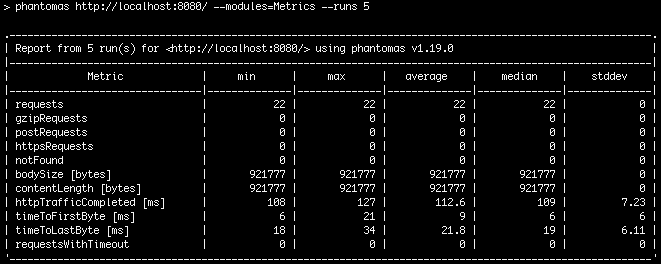

# Team Treehouse Tech Degree - Front-end Web Development - P11 - Optimizing a Site for Performance

## Introduction

This is project #11 of Team Treehouse's Front-end Web Development Tech Degree. In this project, an unoptimized website was given (you can see the initial website metrics in the testing section) and I have to optimize it according to the [project_instructions.pdf](https://github.com/wahidyankf/treehouse-frontend-11-optimizing-a-site-for-performance/blob/master/project_instructions.pdf). The initial code and assets can be seen in the `initial_assets` folder, and you can see the post-optimization's live page [here](https://wahidyankf.github.io/treehouse-frontend-11-optimizing-a-site-for-performance/). The source and the optimization result of this project can be seen in the `src` and `dist` folder of the master branch.

The result of this project is that I successfully:
1. Reduced the browser request from 44 to 23 requests.
2. Reduced the total download size from 12-ish MB to less than 1 MB without making the images looked pixelated.

## Testing

This app was tested using [HTML](https://validator.w3.org/), [CSS](https://jigsaw.w3.org/css-validator/) validator, and [a derivation of phantomas test suite](https://github.com/treehouse-projects/optimization-testing).

Notes: I ignore the error in the HTML and CSS validator because I keep the HTML and CSS structures intact, so the error came from the initial web pages.

### Initial Test Result

### After Optimization Test Result

## Sreenshots

### Site Appearance Before Optimization

### Sita Appearance After Optimization

## License

[MIT](https://en.wikipedia.org/wiki/MIT_License).